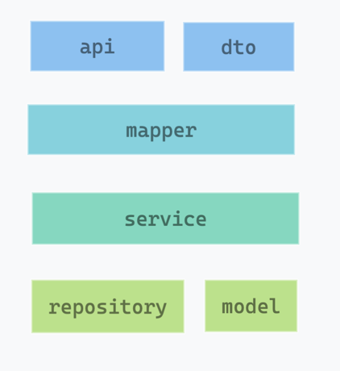
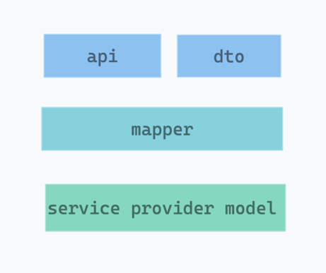
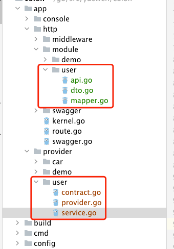
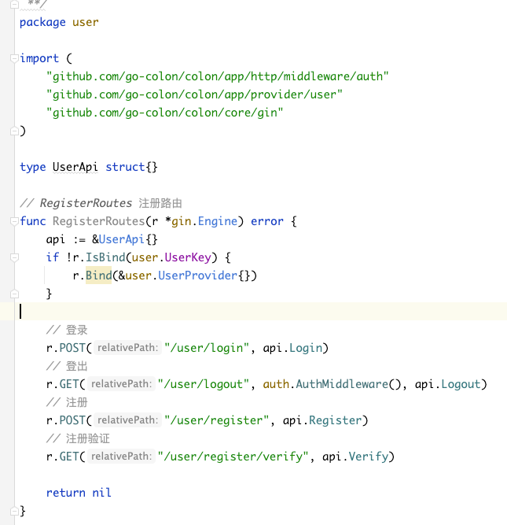

# 目录结构

colon 框架不仅仅是一个类库，也是一个定义了开发模式和目录结构的框架。 colon 希望所有使用这个框架的开发人员遵照统一的项目结构进行开发。

## 默认目录结构
默认创建的项目结构为：

```
[~/go-colon/colon/demo]$ tree
├── README.md
├── app // 服务端应用地址
│   ├── console // 存放自定义命令
│   │   ├── command 
│   │   │   └── foo
│   │   │       └── foo.go // 命令实现
│   │   └── kernel.go
│   ├── http // 存放http服务
│   │   ├── kernel.go
│   │   ├── middleware //自定义中间件
│   │   ├── module  //存放业务模块
│   │   │   └── demo 
│   │   │       ├── api.go  // 业务模块接口
│   │   │       ├── api_cache.go // 缓存
│   │   │       ├── api_goroutine.go 
│   │   │       ├── api_orm.go
│   │   │       ├── dto.go // 业务模块输出结构
│   │   │       ├── mapper.go  // 将服务结构转换为业务模块输出结构
│   │   │       ├── model.go // 数据库结构定义
│   │   │       ├── repository.go // 数据库逻辑封装层
│   │   │       └── service.go // 服务层
│   │   ├── route.go // 路由配置
│   │   ├── swagger // swagger文件自动生成
│   │   └── swagger.go
│   └── provider // 服务提供方
│       └── demo
│           ├── contract.go // 服务接口层
│           ├── provider.go // 服务提供方
│           └── service.go // 服务实现层
├── build
│   ├── ci
│   └── docker //Dcokerfile
│       ├── demo
│       └── user
├── cmd 
│   ├── demo //demo 入口
│   └── user // user 入口
├── config // 配置文件
│   ├── development // 开发配置
│   │   ├── app.yaml
│   │   ├── database.yaml
│   │   ├── deploy.yaml
│   │   ├── log.yaml
│   │   └── ssh.yaml
│   ├── production // 生产配置
│   └── testing // 测试配置
├── core // 框架核心代码

├── docs
├── main.go // 统一入口
├── storage // 存储目录
└── test // 测试相关

```

这里主要介绍下业务模块的分层结构

# 业务模块分层

业务模块的分层设计两种分层模型：简化模型和标准模型。基本稍微复杂一些的业务，都需要使用标准模型开发。

## 简化模型

对于比较简单的业务，每个模块各自定义自己的 model 和 service，在一个 module 文件的文件夹中进行各自模块的业务开发



```
├── api.go // 业务模块接口
├── dto.go // 业务模块输出结构
├── mapper.go // 将服务结构转换为业务模块输出结构
├── model.go // 数据库结构定义
├── repository.go // 数据库逻辑封装层
└── service.go // 服务实现
```
具体参考demo实现：
- module/demo

## 标准模型

对于比较复杂的业务，模块与模块间的交互比较复杂，有很多公用性，所以提取 service provider 服务作为服务间的相互调用。
> 强烈建议使用这种开发模型




第一步：创建当前业务的 provider。可以使用命令行 `./colon provider new` 来创建。
```shell
[~/go-colon/colon/demo]$ ./colon provider new
创建一个服务
? 请输入服务名称(服务凭证)： user
? 请输入服务所在目录名称(默认: 同服务名称): 
创建服务成功, 文件夹地址: /Users/cb/go/src/yuewen/colon/app/provider/user
请不要忘记挂载新创建的服务

```

定义好 provider 的协议

```golang
package user

import (
	"context"
)

const UserKey = "user"

type Service interface {
	// Foo 请在这里定义你的方法
	
	Foo() string

	// Register 注册用户,注意这里只是将用户注册, 并没有激活, 需要调用
	// 参数：user必填，username，password, email
	// 返回值： user 带上token
	Register(ctx context.Context, user *User) (*User, error)

	// Login 登录相关，使用用户名密码登录，获取完成User信息
	Login(ctx context.Context, user *User) (*User, error)

	// GetUser 获取用户信息
	GetUser(ctx context.Context, userID int64) (*User, error)
}

// User 一个管理员用户
type User struct {
}


```

实现对应协议：

```
package user

import "github.com/go-colon/colon/core"

type UserService struct {
	container core.Container
}

func NewUserService(params ...interface{}) (interface{}, error) {
	container := params[0].(core.Container)
	return &UserService{container: container}, nil
}

func (s *UserService) Foo() string {
    return ""
}

```

第二步：创建当前业务的模块

在http/module/user 文件夹中新建文件：



第三步：在当前业务中挂载业务模块。


第四步：使用 provider 来开发当前业务。

``` golang

```

具体实现参考:
- module/user
- provider/user
